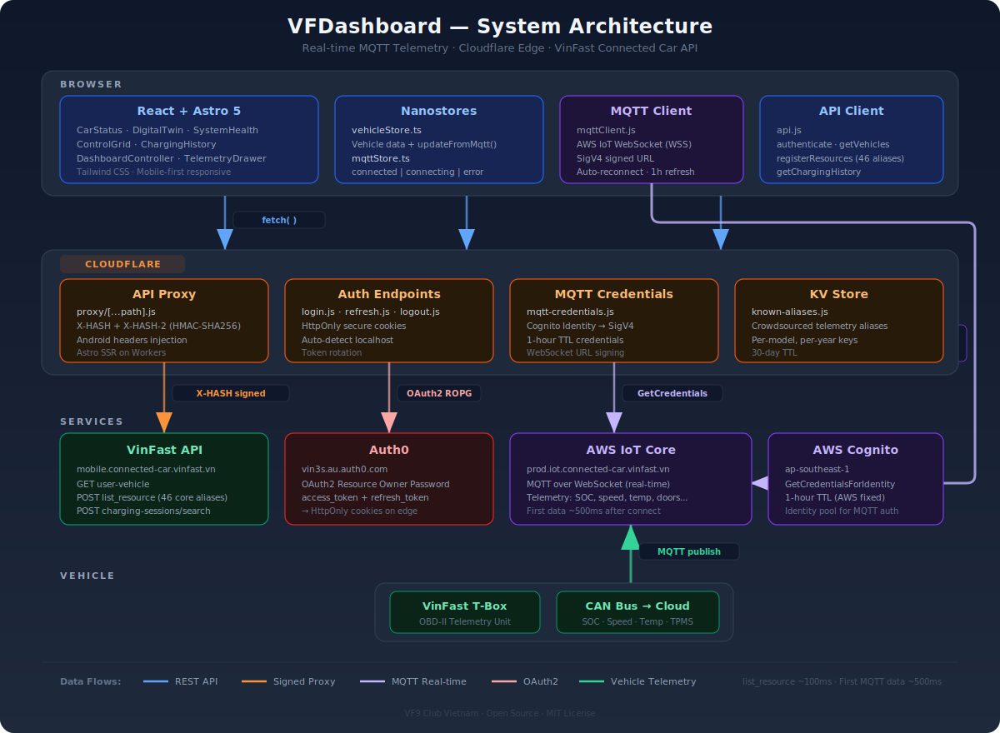
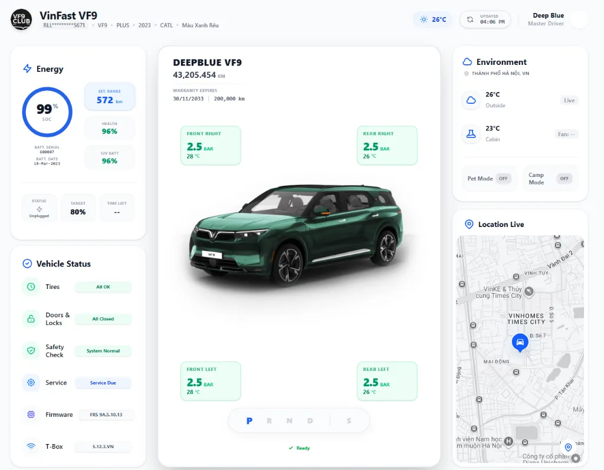
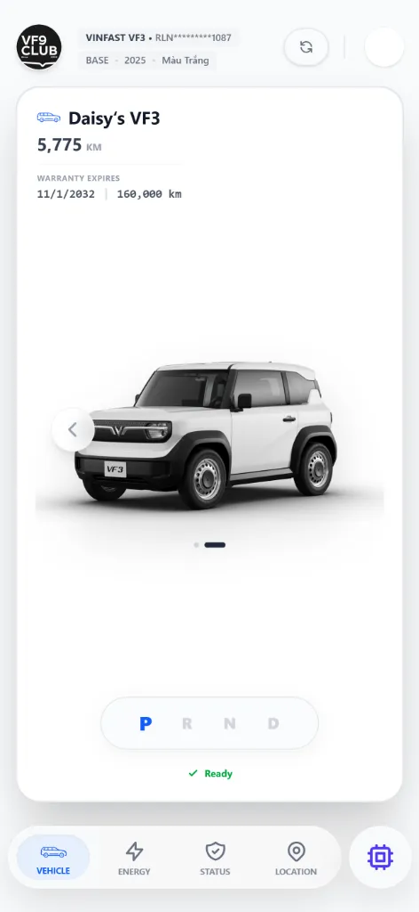
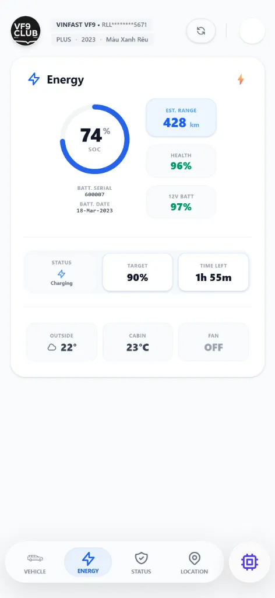
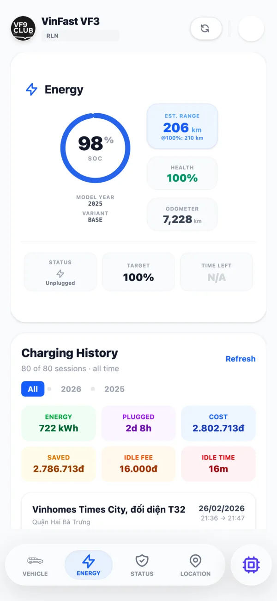

# VinFast Dashboard - VF9 Club Edition


---

> ### 🇻🇳 Thông tin dành cho người dùng Việt Nam
>
> **VFDashboard** ban đầu là công cụ nhỏ phục vụ nhóm anh em chủ xe VF9, không ngờ được lan truyền rộng. Xin chia sẻ một số điểm để anh em yên tâm:
>
> - **Không chính thức, không liên quan đến VinFast.** Website chỉ sử dụng tài khoản VinFast của bạn để kết nối và lấy dữ liệu — tương tự cách app chính thức hoạt động. Hệ thống VinFast chạy trên AWS, bảo mật tốt.
> - **Không thu thập, không lưu trữ bất kỳ dữ liệu nào.** Toàn bộ thông tin (bao gồm mật khẩu) chỉ được chuyển tiếp đến server VinFast/Auth0 qua HTTPS và **không bao giờ được ghi lại** trên hệ thống. Mã nguồn hoàn toàn công khai — ai cũng có thể kiểm chứng.
> - **Thông tin mang tính tham khảo.** Dữ liệu được lấy trực tiếp từ VinFast nhưng không có giá trị chính thức để làm việc với hãng.
> - **Phi lợi nhuận, không scam, không giả mạo.** Dự án luôn ghi rõ là "unofficial" và không hề mạo danh VinFast. Anh em lo lắng về bảo mật có thể tự clone về máy chạy ở local (`npm install && npm run dev`) và dùng AI để đánh giá code.
> - **Link duy nhất:** [**dashboard.vf9.club**](https://dashboard.vf9.club) — không có link nào khác. Khuyến khích chạy local để trải nghiệm ổn định nhất.
> - **Lỗi không kết nối được?** Do server VinFast giới hạn tần suất truy cập (rate limit) từ proxy, không phải do hệ thống quá tải.
>
> ---
>
> #### ⚠️ Về việc website bị report "phishing"
>
> Team VinFast đã report website lên Cloudflare với nội dung **không đúng sự thật**, cụ thể:
>
> - ❌ *"Mật khẩu được lưu dưới dạng plaintext"* → **Sai.** Hệ thống chỉ chuyển tiếp thông tin đăng nhập đến Auth0 (hệ thống xác thực của chính VinFast) qua HTTPS, **không ghi log, không lưu trữ**. Toàn bộ mã nguồn công khai — ai cũng có thể kiểm tra.
> - ❌ *"Website giả mạo VinFast"* → **Sai.** Dự án luôn ghi rõ "unofficial", không dùng logo VinFast, không mạo danh, và ghi rõ "not affiliated with VinFast" ngay trên trang này.
> - ❌ *"Thu thập dữ liệu người dùng trái phép"* → **Sai.** Không có dữ liệu nào được lưu trên server. Mọi thông tin chỉ nằm trên trình duyệt của bạn (HttpOnly cookies), giống hệt cách app chính thức hoạt động.
>
> Chúng tôi hơi thất vọng vì VinFast chọn cách report thay vì liên hệ trực tiếp. Dự án này xuất phát từ đam mê xe điện và mong muốn bổ sung những tính năng mà app chính thức chưa có — hoàn toàn vì cộng đồng.
>
> ---
>
> Giao lưu cùng tác giả: [**ANH EM VF9 - VF9 CLUB**](https://www.facebook.com/groups/706124277686588/)
>
> *📄 English documentation below.*

---

## 🔄 **Status Update** (February 2026)

> **Dashboard is fully operational with real-time MQTT telemetry!** All vehicle data streams live via MQTT over WebSocket — first data arrives ~500ms after connect.
>
> ✅ **MQTT Live Telemetry**: Real-time data via AWS IoT Core (battery, doors, tires, location, speed, charging).\
> ✅ **X-HASH + X-HASH-2**: Dual-layer API signing on all protected endpoints.\
> ✅ **Multi-Vehicle**: Instant switching between vehicles with cached telemetry.\
> ✅ **Charging History**: Full session history with smart filtering.\
> ✅ **Deep Scan**: Progressive telemetry viewer with crowdsourced KV aliases.\
> 📚 **Documentation**: [API Endpoints](./docs/api/API_ENDPOINTS.md) | [X-HASH Technical Docs](./docs/api/HASH_ANALYSIS_SUMMARY.md) | [MQTT Telemetry](./docs/api/MQTT_TELEMETRY.md)\
> 🌐 **Bilingual docs**: English at `docs/api/`, Vietnamese at `docs/api/vi/`

---

## 📖 Introduction

This project is an open-source dashboard designed specifically for VinFast EV owners. It leverages the vehicle's telemetry data to provide a "Digital Twin" experience, offering real-time insights into battery health, charging status, tire pressure, and environmental conditions.

Our goal is to create a UI that matches the premium quality of the car itself—clean, modern, and informative.

## ✨ Features

- **Digital Twin Visualizer**: Accurate representation of vehicle status including doors, locks, and tires.
- **Mobile-First Experience**: Optimized specifically for phone screens with zero scrollbars, fixed viewports, and touch-friendly layouts.
- **Real-time Telemetry via MQTT**: Live streaming of Battery SOC, Range, Speed, Charging status, and more via AWS IoT Core WebSocket.
- **Safety Monitor**: Integrated alerts for Tire Pressure (TPMS), Door Ajar, and Intrusion.
- **System Health**: Overview of ECU versions (BMS, Gateway, MHU) and FOTA updates.
- **Responsive Design**: A "Bento Grid" layout that adapts seamlessly from Desktop to Mobile.

## 🛠 Tech Stack

- **Core**: Astro 5, React, Tailwind CSS, Nanostores.
- **Backend**: Serverless Proxy (Astro SSR on Cloudflare Pages) with multi-proxy 429 failover.
- **Telemetry**: MQTT over WebSocket (AWS IoT Core) — real-time, no polling.
- **Auth**: Auth0 OAuth2 with HttpOnly cookies (auto-detects localhost for local dev).
- **Storage**: Cloudflare KV for crowdsourced telemetry aliases.

## 🏗 System Architecture



## 🚀 Quick Start

You can get the whole system running in minutes.

### Prerequisites

- Node.js v22 or later
- A VinFast Connected Car Account

### Installation

1.  **Clone the repository**:

    ```bash
    git clone https://github.com/VF9-Club/VFDashboard.git
    cd VFDashboard
    ```

2.  **Start the Dashboard**:
    ```bash
    npm install
    npm run dev
    ```
    _Dashboard will open at `http://localhost:4321`_

### Deployment

To deploy the dashboard to Cloudflare Pages:

```bash
npm run deploy
```

_Note: Requires Cloudflare authentication (`npx wrangler login`)._

## ⚠ Disclaimer

**This software is not affiliated with, endorsed by, or connected to VinFast Auto or its subsidiaries.**
It is an unofficial, open-source project created by the community for educational and personal use. Use at your own risk.

## 📸 Screenshots

### Dashboard (PC / Tablet)



### Mobile & Detail View

<table><tr>
  <td></td>
  <td></td>
  <td></td>
</tr></table>

## 🤝 Contributing

We welcome contributions from the community!

1.  Fork the Project
2.  Create your Feature Branch (`git checkout -b feature/AmazingFeature`)
3.  Commit your Changes (`git commit -m 'Add some AmazingFeature'`)
4.  Push to the Branch (`git push origin feature/AmazingFeature`)
5.  Open a Pull Request

## 🌍 Community Forks

VinFast owners in different regions maintain their own forks tailored to local needs:

| Fork                                                                                        | Maintainer                    | Focus                                                |
| ------------------------------------------------------------------------------------------- | ----------------------------- | ---------------------------------------------------- |
| [vinfastownersorg-cyber/VFDashboard](https://github.com/vinfastownersorg-cyber/VFDashboard) | Association of VinFast Owners | North America, self-hosted (Render, Docker, Railway) |

> Want to add your fork? Open an issue or PR!

## 🙏 Acknowledgments

This project was developed based on inspiration and valuable technical documentation regarding APIs from the [**VinFast Owners**](https://vinfastowners.org/) community. We sincerely thank the team at [VinFast Owners Community](https://github.com/vinfastownersorg-cyber/vinfastowners) for their foundational contributions to this open-source ecosystem.

Selected improvements from community forks are periodically reviewed and backported into this public branch when they align with security, maintainability, and broad community usage.

We warmly welcome all VinFast owners and technology enthusiasts to collaborate and help improve the public dashboard experience.

## 💬 An Open Letter to VinFast

Dear VinFast Team,

This project was born out of genuine love for VinFast vehicles. We are passionate owners who wanted features the official app doesn't yet provide — real-time battery telemetry, tire pressure history, charging analytics, and a digital twin experience. This is not competition; this is **free R&D from your most loyal customers**.

### On the Recent Takedown Report

We were disappointed to learn that VinFast reported this project with claims that are **factually incorrect**:

- ❌ *"credentials stored in plaintext"* — **False.** The proxy forwards credentials to Auth0 over HTTPS and **never logs or stores them**. The entire codebase is open-source — anyone can verify this. See [Issue #68](https://github.com/VF9-Club/VFDashboard/issues/68) for a detailed technical discussion.
- ❌ *"fake application impersonating VinFast"* — **False.** The project has always been clearly labeled as **unofficial and community-built**. It does not use VinFast branding, does not claim affiliation, and states "not affiliated with VinFast" prominently in this README.
- ❌ *"illegally stored user data"* — **False.** No user data is stored on any server. All data flows directly between the user's browser and VinFast's own APIs. Session tokens are stored in the user's browser only (HttpOnly cookies), exactly as the official app does.

We would have welcomed a direct conversation before a takedown report based on inaccurate claims.

### A Better Path Forward

Many car manufacturers (Tesla, BMW, Mercedes, Hyundai/Kia) have recognized that third-party apps **increase customer satisfaction and brand loyalty**. Instead of an adversarial approach, we hope VinFast will consider:

1. **A public API program** (even read-only) with proper OAuth and rate limits
2. **Developer documentation** for vehicle telemetry endpoints
3. **Engaging with the community** rather than suppressing it

We built this in the open, with good intentions. We still hope to work **with** VinFast, not around them.

With respect,\
**The VFDashboard Community**

---

## 📜 License

Distributed under the MIT License. See `LICENSE` for more information.

---

_Built with ❤️ by VF9 Club Vietnam_
